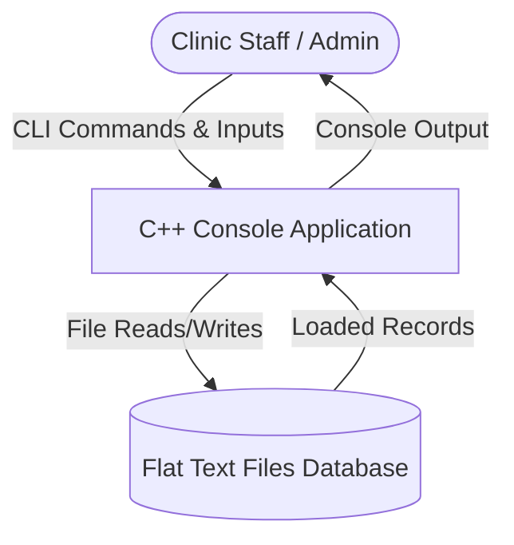
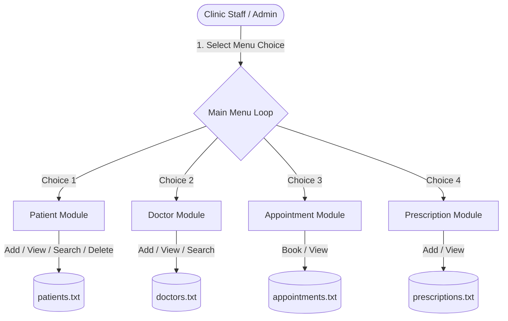
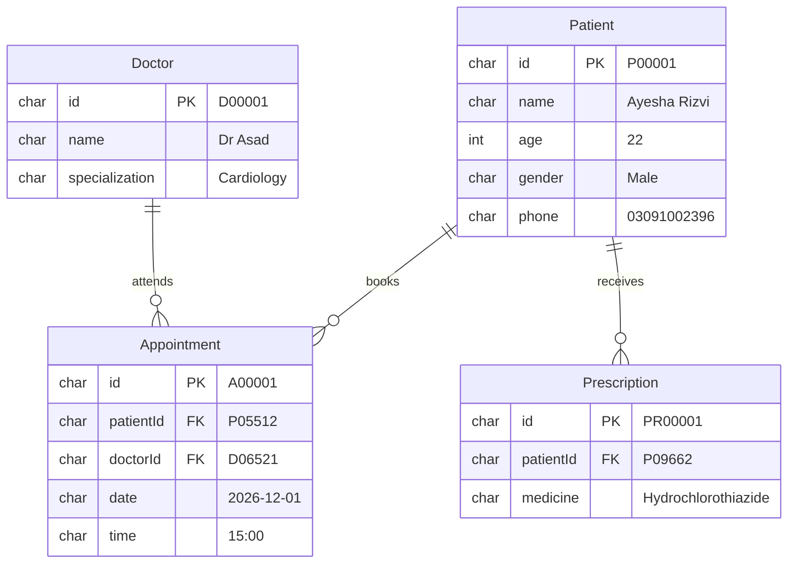

# Part 1 – Legacy Architecture & Reverse Engineering Documentation

## 1. Legacy Architecture Documentation
The legacy Clinic Management System (v1.0) is a monolithic, single-threaded desktop console application developed in procedural C++. 

### 1.1 Structural Overview
* **Programming Paradigm**: Procedural C++ utilizing `struct` objects for data representations (Patient, Doctor, Appointment, Prescription) without OOP principles like encapsulation, inheritance, or polymorphism.
* **User Interface**: Console-based, menu-driven CLI using standard input/output (`std::cin`, `std::cout`).
* **Persistence Layer**: Sequential, pipe-delimited flat text files (`patients.txt`, `doctors.txt`, `appointments.txt`, `prescriptions.txt`) stored directly on the local filesystem.
* **Database Driver**: Hand-rolled file I/O operations using `<fstream>` (`ifstream` for sequential scanning and reading, `ofstream` for appending and rewriting files).

### 1.2 Data Flow Diagram (DFD) - Level 0 & Level 1

#### Level 1 DFD: Detailed Process Flows

---

## 2. Legacy Entity-Relationship (ER) Diagram
The legacy database consists of implicit associations implemented via primary key string matchings. No foreign key constraints, cascading deletes, or referential integrity validations are supported at the persistence level.

---

## 3. Legacy Database Analysis
Data is persisted in flat files using pipe-delimited values (`|`) and carriage-return/newline terminators.

* **patients.txt Format**: `[PatientID]|[Name]|[Age]|[Gender]|[Phone]`
  * Example: `P00001|Ayesha Rizvi|22|Male|03091002396`
* **doctors.txt Format**: `[DoctorID]|[Name]|[Specialization]`
  * Example: `D00001|Nargis Shehzad|Endocrinology`
* **appointments.txt Format**: `[AppointmentID]|[PatientID]|[DoctorID]|[Date]|[Time]`
  * Example: `A00001|P05512|D06521|2026-12-01|15:00`
* **prescriptions.txt Format**: `[PrescriptionID]|[PatientID]|[MedicineName]`
  * Example: `PR00001|P09662|Hydrochlorothiazide`

---

## 4. Architecture Limitations & Issues

### 4.1 Scalability Issues
* **Linear Time Complexity (O(N)) Searches**: To find a record (e.g., patient, doctor), the legacy program opens the file and reads it line-by-line from the beginning until a match is found. For 50,000+ records, this takes seconds and scales linearly.
* **Memory Limits**: The application does not support indexing, paging, or partial updates. Any table listings read the entire file sequentially, placing severe strain on I/O operations and CPU when files grow large.
* **Disk I/O Bottlenecks**: Deleting records requires reading the entire source file, filtering out the deleted row, writing everything else to a temporary file, deleting the original file, and renaming the temporary file. This is highly inefficient.

### 4.2 Maintainability Issues
* **Procedural Code Spaghetti**: Business logic, file parsing, formatting, and UI rendering are tightly coupled in monolithic functions.
* **No Unit Testing Support**: There are no tests, and code cannot be easily refactored without introducing regressions.
* **Hardcoded Constraints**: Buffers are defined with hardcoded array sizes (`MAX_LEN 100`, `NAME_LEN 60`, etc.), making the system prone to buffer overflows if inputs exceed constraints.

### 4.3 Security Issues
* **Zero Authentication / Authorization**: The console executable runs directly, allowing anyone with local access to read, modify, or delete the patient database.
* **Plaintext Storage**: All patient names, phone numbers, and clinical prescriptions are saved in raw text on disk, directly violating medical data privacy standards (HIPAA, GDPR).
* **Injection Vulnerabilities**: Pipe characters (`|`) in patient names or telephone fields corrupt the structure of the database files, causing columns to shift.

### 4.4 Concurrency Issues
* **No File Locking**: If two clinic terminals attempt to append to `appointments.txt` simultaneously, data corruption, write conflicts, or data loss will occur.
