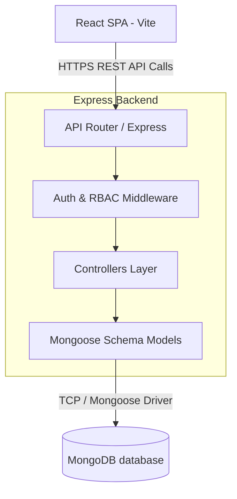
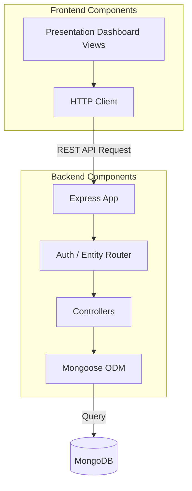
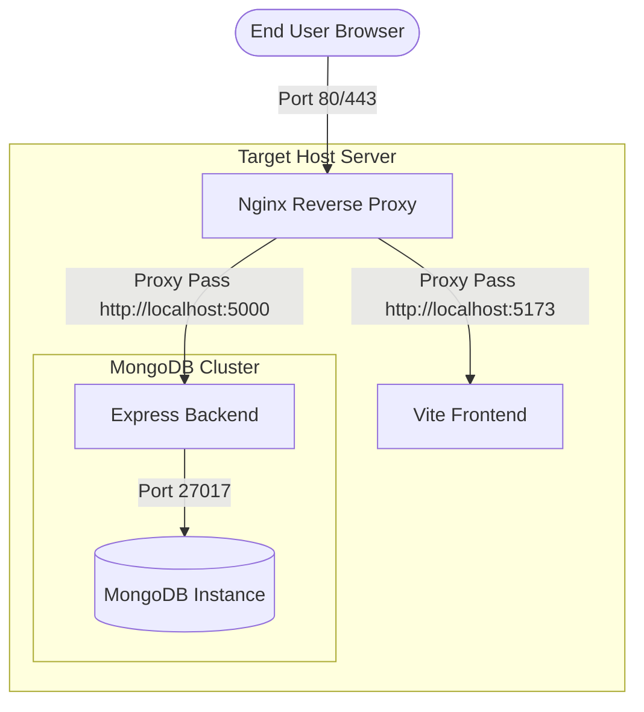
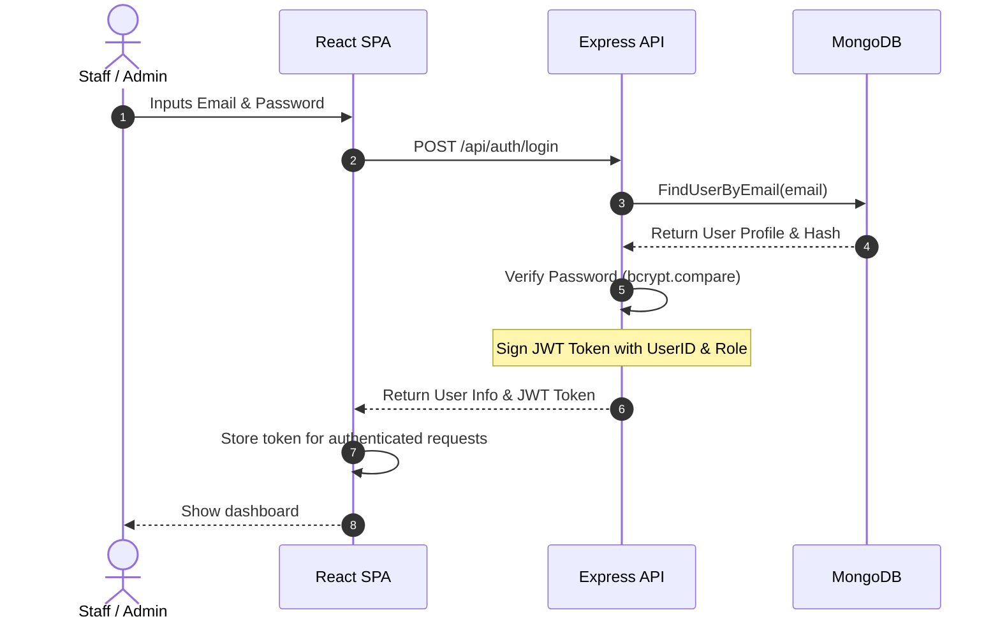
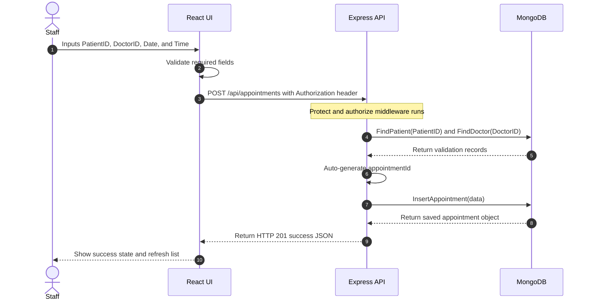

# Part 2 - Modern Enterprise Architecture Design

The modern system is designed as a three-tier, web-based enterprise application built on the MERN (MongoDB, Express, React, Node) stack. It features schema validation, centralized middleware control, role-based access controls, and production-ready APIs.

---

## 1. High-Level Architecture Diagram
The architecture consists of a decoupled frontend client communicating with a REST API backend, backed by MongoDB.

---

## 2. Component Diagram
Details the key software components and modules within the modern architecture.

---

## 3. Deployment Diagram
Illustrates a modern Dockerized deployment model with reverse proxying and automated scaling.

---

## 4. Sequence Diagrams

### 4.1 Authentication Flow (Login)

### 4.2 Booking Appointment Flow

